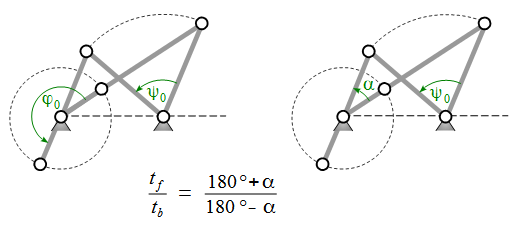

# Crank-Rocker

<code>Crocker</code> is a javascript namespace and function library, which has proven successful in designing and analyzing Crank-Rockers 
as special planar fourbar mechanisms. <code>Crocker.js</code> is tiny, it weights only 1.5 kB compressed and gzipped.

<code>Crocker</code> is *not* meant to simulate mechanisms. For this and general fourbar mechanisms see [fourbar](https://github.com/goessner/fourbar).

Here is a *Crank-Rocker* [animation](https://goessner.github.io/morphr/examples/complex.html) using the tiny
[Morphr](https://github.com/goessner/morphr) javascript class and a [g2](https://github.com/goessner/g2) command queue
for vector graphics.

## Geometry

A *Crank-Rocker* is a specific *fourbar* mechanism. It is composed of four binary links that are connected to each other 
by revolute joints. These links are called *crank*, *coupler*, *rocker* and *frame*. Their lengths are 
named <code>a, b, c, d</code> respectively.


The input *crank* is fully rotatable and performs a complete 360° turn. At the same time the *rocker* oscillates 
between its extreme positions <code>ψ_min</code> and <code>ψ_max</code>. Both *crank* and *rocker* are connected to 
the *fixed frame* by pivots. The *coupler* functions as a *connecting rod* between that two. 



The rocker's working angular range is named <code>ψ_0</code> and corresponds during tracking motion 
(crank and rocker move unidirectional - counterclockwise here) to the crank's angular range <code>φ_0</code>.
On their way back they run in opposite directions. The crank's angle is <code>360° - φ_0</code> then and the rocker's
<code>-ψ_0</code>. As a descriptive angle we use the difference <code>α = 180° - φ_0</code> here.
So if <code>φ_0</code> is not 180° or <code>α</code> is not 0°, the crank needs different times for the rocker's 
*back* and *forth* motion. This degree of non-uniformity can be expressed by the ratio <code>t_f/t_b</code>, which is
an important parameter of the engineer's point of view while designing a crank-rocker mechanism and 
directly relates to <code>α</code>. The other important design parameter of course is the rocker's 
angular range <code>ψ_0</code>.

As the four link lengths <code>a, b, c, d</code> sufficiently define a specific crank-rocker and <code>α</code> and <code>ψ_0</code> 
are added as important design parameters, there must be two relations between those now *six* parameters. It can be shown
that these relations are:


Another important value is the transmission angle <code>μ</code> between *coupler* and *rocker*. Of special interest here is the 
*minimal* transmission angle <code>μ_min</code> which occurs, when the *crank* is collinear with the *frame*. This happens two 
times while the crank performs a complete rotation.


So the minimal transmission angle <code>μ_min</code> has to be calculated as <code>min(μ_inner,μ_outer)</code>.
Please note, that - as a convention - the transmission angle is always considered to be in the range <code>0 < μ <= 90°</code>. So in case
<code>μ</code> happens to be greater than 90°, its supplement angle (<code>180° - μ</code>) should be taken instead.

Ideally the transmission angle is always 90°, which isn't possible of course. So a specific design goal with crank-rockers
is to *maximize* the minimal transmission angle. A valuable optimization method regarding this can be applied with <code>crocker.js</code>.

See [[1]](#fn1), [[2]](#fn2) or [[3]](#fn3) for further details.

## Implementation

The <code>crocker</code> library consists mostly of small functions. It is no <code>class</code>, so you cannot
instantiate any Crank-Rocker objects.

The most simple way to use the <code>crocker</code> library is with <code>node.js</code>.

### Node Example - Simple Crank-Rocker

```javascript
function toRad(w) { return w/180*Math.PI; }
function toDeg(w) { return w*180/Math.PI; }

var crocker = require("../crocker.js");

// Design a Crank-Rocker with 
// * Given crank and frame length
// * Rocker's angular range of 80°
// * A forth and back ratio of 10/9
var a = 60,
    d = 120,
    psi0 = toRad(80),
    alfa = crocker.alfa_tfb(10/9),
    b = crocker.b_ad(a,d,alfa,psi0),
    c = crocker.c_ad(a,d,alfa,psi0),
    muMin = crocker.muMin(a,b,c,d);

console.log("psi0 = " + toDeg(psi0));   // 80°
console.log("alfa = " + toDeg(alfa));   // 9.5°
console.log("b = " + b);                // 103
console.log("c = " + c);                //  94
console.log("muMin = " + toDeg(muMin)); // 35°
```

Here is a table of <code>Crocker</code> functions. Please note that these functions are only loosely coupled. Usually the validity 
of the parameter set handed over to them is checked in the context, from where they are invoked. So please ensure to use valid
parameters, as 

* <code>a,b,c,d</code> are Grashof positive.
* <code>a</code> is the smallest link length.
* <code>ψ_0</code> is smaller than 180°.
* All angles are provided in radians.

just to name a few.

| Function | Comment |
| --- | --- | --- |
| <code>.psiMin(a,b,c,d)</code> | Minimal Rocker angle `ψ_min`. |
| <code>.psiMax(a,b,c,d)</code> | Maximal Rocker angle `ψ_max`. |
| <code>.phiMin(a,b,c,d)</code> | Crank angle `ϕ_min` corresponding to rocker angle `ψ_min`. |
| <code>.phiMax(a,b,c,d)</code> | Crank angle `ϕ_max` corresponding to rocker angle `ψ_max`. |
| <code>.phi0(a,b,c,d)</code> | Crank angular range `ϕ_0` corresponding to `ψ_0` in unidirectional mode. |
| <code>.muInner(a,b,c,d)</code> | Transmission angle `μ_inner` corresponding to crank's inner frame position. |
| <code>.muOuter(a,b,c,d)</code> | Transmission angle `μ_outer` corresponding to crank's outer frame position. |
| <code>.muMin(a,b,c,d)</code> | Minimal Transmission angle `μ_min`. |
| <code>.alfa_tfb(tfb)</code> | Crank angular range difference `α` from time ratio `tf/tb` of rocker's forth and back moving times. |
| <code>.a_muMinMax(d,alfa,psi0)</code> | Crank length for maximized minimal transmission angle. |

The other functions in the <code>crocker</code> library help to determine the missing parameters when four 
out of the six <code>a, b, c, d, α, ψ_0</code> are given. The following table shows those 
functions with their required arguments:

| function | <code>a</code> | <code>b</code> | <code>c</code> | <code>d</code> | <code>α</code> | <code>ψ_0</code> | 
| --- | --- | --- | --- | --- | --- | --- |
| <code>.alfa</code> | <code>\*</code> | <code>\*</code> | <code>\*</code> | <code>\*</code> | <code>-</code> | <code>-</code> |
| <code>.alfa_abc</code> | <code>\*</code> | <code>\*</code> | <code>\*</code> | <code>-</code> | <code>-</code> | <code>\*</code> |
| <code>.alfa_abd</code> | <code>\*</code> | <code>\*</code> | <code>-</code> | <code>\*</code> | <code>-</code> | <code>\*</code> |
| <code>.alfa_acd</code> | <code>\*</code> | <code>-</code> | <code>\*</code> | <code>\*</code> | <code>-</code> | <code>\*</code> |
| <code>.alfa_bcd</code> | <code>-</code> | <code>\*</code> | <code>\*</code> | <code>\*</code> | <code>-</code> | <code>\*</code> |
| <code>.psi0</code> | <code>\*</code> | <code>\*</code> | <code>\*</code> | <code>\*</code> | <code>-</code> | <code>-</code> |
| <code>.psi0_abc</code> | <code>\*</code> | <code>\*</code> | <code>\*</code> | <code>-</code> | <code>\*</code> | <code>-</code> |
| <code>.psi0_abd</code> | <code>\*</code> | <code>\*</code> | <code>-</code> | <code>\*</code> | <code>\*</code> | <code>-</code> |
| <code>.psi0_acd</code> | <code>\*</code> | <code>-</code> | <code>\*</code> | <code>\*</code> | <code>\*</code> | <code>-</code> |
| <code>.psi0_bcd</code> | <code>-</code> | <code>\*</code> | <code>\*</code> | <code>\*</code> | <code>\*</code> | <code>-</code> |
| <code>.a_bc</code> | <code>-</code> | <code>\*</code> | <code>\*</code> | <code>-</code> | <code>\*</code> | <code>\*</code> |
| <code>.a_bd</code> | <code>-</code> | <code>\*</code> | <code>-</code> | <code>\*</code> | <code>\*</code> | <code>\*</code> |
| <code>.a_cd</code> | <code>-</code> | <code>-</code> | <code>\*</code> | <code>\*</code> | <code>\*</code> | <code>\*</code> |
| <code>.b_ac</code> | <code>\*</code> | <code>-</code> | <code>\*</code> | <code>-</code> | <code>\*</code> | <code>\*</code> |
| <code>.b_ad</code> | <code>\*</code> | <code>-</code> | <code>-</code> | <code>\*</code> | <code>\*</code> | <code>\*</code> |
| <code>.b_cd</code> | <code>-</code> | <code>-</code> | <code>\*</code> | <code>\*</code> | <code>\*</code> | <code>\*</code> |
| <code>.c_ab</code> | <code>\*</code> | <code>\*</code> | <code>-</code> | <code>-</code> | <code>\*</code> | <code>\*</code> |
| <code>.c_ad</code> | <code>\*</code> | <code>-</code> | <code>-</code> | <code>\*</code> | <code>\*</code> | <code>\*</code> |
| <code>.c_bd</code> | <code>-</code> | <code>\*</code> | <code>-</code> | <code>\*</code> | <code>\*</code> | <code>\*</code> |
| <code>.d_ab</code> | <code>\*</code> | <code>\*</code> | <code>-</code> | <code>-</code> | <code>\*</code> | <code>\*</code> |
| <code>.d_ac</code> | <code>\*</code> | <code>-</code> | <code>\*</code> | <code>-</code> | <code>\*</code> | <code>\*</code> |
| <code>.d_bc</code> | <code>-</code> | <code>\*</code> | <code>\*</code> | <code>-</code> | <code>\*</code> | <code>\*</code> |

### Node Example - Optimal Crank-Rocker

```javascript
function toRad(w) { return w/180*Math.PI; }
function toDeg(w) { return w*180/Math.PI; }

var Crocker = require("./crocker.js").Crocker;

// Design a Crank-Rocker with 
// * Given frame length
// * Rocker's angular range of 80°
// * A forth and back ratio of 10/9
// Find the optimal Crank-Rocker with maximum of minimal transmission angle.
var d = 120,
    psi0 = toRad(80),
    alfa = Crocker.alfa_tfb(10/9),
    a = Crocker.a_muMinMax(d,alfa,psi0),
    b = Crocker.b_ad(a,d,alfa,psi0),
    c = Crocker.c_ad(a,d,alfa,psi0),
    muMin = Crocker.muMin(a,b,c,d);

console.log("psi0 = " + toDeg(psi0));   // 80°
console.log("alfa = " + toDeg(alfa));   // 9.5°
console.log("a = " + a);                // 46.7
console.log("b = " + b);                // 116
console.log("c = " + c);                // 73.9
console.log("muMin = " + toDeg(muMin)); // 37.7°
```

Here is a [graphics example](https://goessner.github.io/crocker/Examples/crockerdraw.html) using `crocker.js` and [g2](https://github.com/goessner/g2).


## References

<a name="fn1">[1]</a> S. Gössner: [Getriebelehre - Vektorielle Analyse ebener Mechanismen](http://www.amazon.de/Getriebelehre-Vektorielle-Analyse-ebener-Mechanismen/dp/3832530827)

<a name="fn2">[2]</a> J.M. McCarthy: [Geometric Design of Linkages](http://www.amazon.com/Geometric-Linkages-Interdisciplinary-Applied-Mathematics/dp/1441978917)

<a name="fn3">[3]</a> J.J. Uicker: [Theory of Machines and Mechanisms](http://www.amazon.co.uk/Theory-Machines-Mechanisms-Joseph-Uicker/dp/0195371232)


## API Reference
See the [API Reference](./api.md) for details.


#Change Log

All notable changes to this project will be documented here. This project adheres to Semantic Versioning.

## 0.8.0 - 2016-03-25

### First Commit to Github
